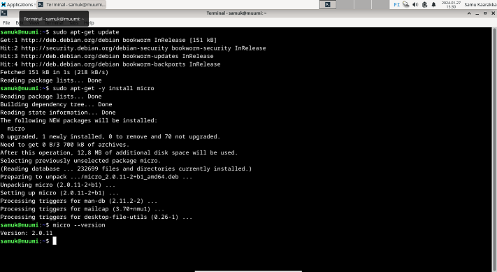
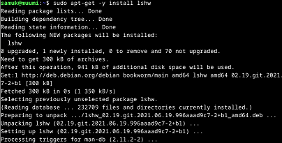

# h2 Komentaja Pingviini

## x) Lue ja tiivistä

### Commmand line basics revisited
Komentorivi on työkalu, joka mahdollistaa esimerkiksi ohjelmien asentamisen/pyörittämisen, tiedostojen hallinnan sekä koneen yleisen hallinnan nopeasti sekä kivuttomasti. Komentotulkin avulla käyttäjän komentoriville syöttämät käskyt saadaan sellaiseen muotoon, jotta tietokone ymmärtää ja osaa toteuttaa kyseiset käskyt. 
Komentorivillä pystyy käyttämään monia komentoja, jotka helpottavat työskentelyä. Ohessa listattuna tärkeitä peruskomentoja:

* pwd: kertoo nykyisen työhakemiston
* ls: listaa sen hetkisen työhakemiston tiedostot
* cd: vaihtaa hakemistoa
* rm: poistaa tiedostoja tai hakemistoja
* cp: kopioi tiedostoja tai hakemistoja
* mkdir: luo uuden hakemiston
* nano: avaa tekstieditorin (nimeltään nano) tiedoston muokkaamista varten

Koko järjestelmää koskevat toiminnot (esimerkiksi ohjelmistojen asentaminen/poistaminen, käyttäjien luominen, käyttöoikeuksien hallinta) vaativat korkeampia käyttöoikeuksia ja näihin toimintoihin käytetään ”sudo” komentoa. Esimerkiksi ohjelmiston asentaminen käy kätevästi komennolla: sudo apt-get install ohjelmanimi. Tosin ennen uuden ohjelman asentamista on hyvä suorittaa komento ”sudo apt-get update”, koska näin varmistetaan, että pakettivarastot ovat ajantasalla.

Lähde:
Karvinen, Tero. Command Line Basics Revisited. Julkaistu 02.03.2020. Luettu 27.01.2024. https://terokarvinen.com/2020/command-line-basics-revisited/?fromSearch=command%20line%20basics%20revisited 

### a)Micron asentaminen

Tässä tehtävässä asensin micro-nimisen tekstieditorin:

* "sudo apt-get update" kommennolla varmistin alkuun, että kaikki paketit ovat ajantasalla.
* "sudo apt-get -y install micro" kommennolla asensin tekstieditorin nimeltä micro
* Lopuksi tarkistin "micro --version" kommennolla, että tekstieditorin micro asennus varmasti onnistui

### b)Rauta

Seuraavaksi asensin lshw(hardware lister)työkalun:

Tämän jälkeen käytin ‘sudo lshw -short -sanitize’ komentoa näyttämään listan laitteen tiedoista:

