# h2 Komentaja Pingviini

## x) Lue ja tiivistä

### Commmand line basics revisited
Komentorivi on työkalu, joka mahdollistaa esimerkiksi ohjelmien asentamisen/pyörittämisen, tiedostojen hallinnan sekä koneen yleisen hallinnan nopeasti sekä kivuttomasti. Komentotulkin avulla käyttäjän komentoriville syöttämät käskyt saadaan sellaiseen muotoon, jotta tietokone ymmärtää ja osaa toteuttaa kyseiset käskyt. 
Komentorivillä pystyy käyttämään monia komentoja, jotka helpottavat työskentelyä. Ohessa listattuna tärkeitä peruskomentoja:

* pwd: kertoo nykyisen työhakemiston
* ls: listaa sen hetkisen työhakemiston tiedostot
* cd: vaihtaa hakemistoa
* rm: poistaa tiedostoja tai hakemistoja
* cp: kopioi tiedostoja tai hakemistoja
* mkdir: luo uuden hakemiston
* nano: avaa tekstieditorin (nimeltään nano) tiedoston muokkaamista varten

Koko järjestelmää koskevat toiminnot (esimerkiksi ohjelmistojen asentaminen/poistaminen, käyttäjien luominen, käyttöoikeuksien hallinta) vaativat korkeampia käyttöoikeuksia ja näihin toimintoihin käytetään ”sudo” komentoa. Esimerkiksi ohjelmiston asentaminen käy kätevästi komennolla: sudo apt-get install ohjelmanimi. Tosin ennen uuden ohjelman asentamista on hyvä suorittaa komento ”sudo apt-get update”, koska näin varmistetaan, että pakettivarastot ovat ajantasalla.

Lähde:
Karvinen, Tero. Command Line Basics Revisited. Julkaistu 02.03.2020. Luettu 27.01.2024. https://terokarvinen.com/2020/command-line-basics-revisited/?fromSearch=command%20line%20basics%20revisited 

### a)Micron asentaminen

Tässä tehtävässä asensin micro-nimisen tekstieditorin:

* "sudo apt-get update" kommennolla varmistin alkuun, että kaikki paketit ovat ajantasalla.
* "sudo apt-get -y install micro" kommennolla asensin tekstieditorin nimeltä micro
* Lopuksi tarkistin "micro --version" kommennolla, että tekstieditorin micro asennus varmasti onnistui

### b)Rauta

Seuraavaksi asensin lshw(hardware lister)työkalun:

Tämän jälkeen käytin ‘sudo lshw -short -sanitize’ komentoa näyttämään listan laitteen tiedoista:

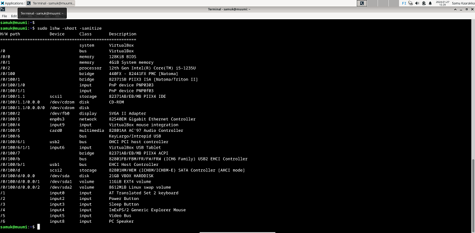

Alla avaan hieman kuvan tulosteita sekä mitä ne tarkoittavat: 

#### H/W path:
* Viittaa laitteiston polkuun, joka esittää hierarkisen rakenteen laitteen eri komponenteista
* Kertoo laitteen sijannin laitteistorakenteessa
* Esimerkiksi kohta /0/1 viittaa kuvan tapauksessa muistiyksikköön (Class: Memory), jossa Description kohdassa näkyy, että RAM-muistia on 4gigatavua

#### Device:
* Laite,joka on liitetty järjestelmään

#### Class:
* Laitteen luokka/tyyppi

#### Description:
* Kuvaus laitteesta

#### C)Apt (advanced package tool)
Tässä tehtävässä asensin apt-työkalua käyttäen 3 uutta komentoriviohjelmaa (ranger,htop sekä neofetch) . Katsoin verkosta ohjeen, miten kaikki 3 ohjelmaa saa asennettua kerralla:

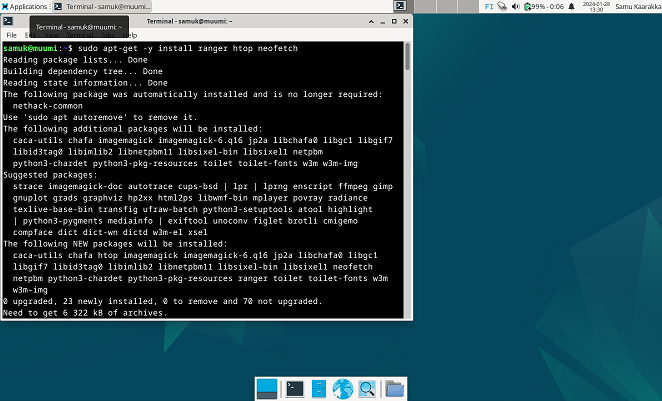

Tämän jälkeen kokeilin, että mitä kukin ohjelma tekee:

#### Ranger 
*Tekstipohjainen ohjelma, jonka avulla on kätevää selata, hallita ja katsella tiedostoja sekä hakemistoja terminaalissa:

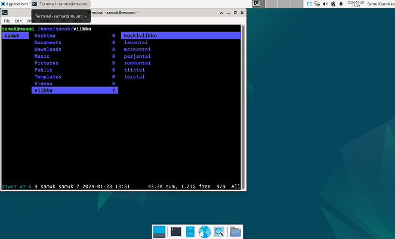

#### Htop
*Näyttää näkymän käynnissä olevista prosesseista sekä niiden resurssien käytöstä:

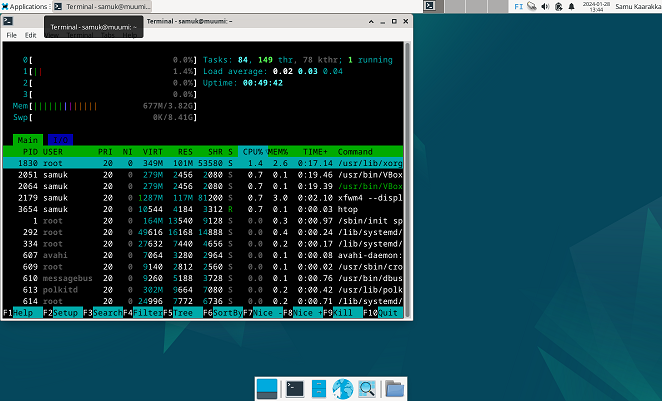

#### Neofetch
*Näyttää tietoja tietokoneesta sekä järjestelmästä, esimerkiksi käyttöjärjestelmän nimen, asennettujen pakettien määrän sekä RAM-muistin määrän:

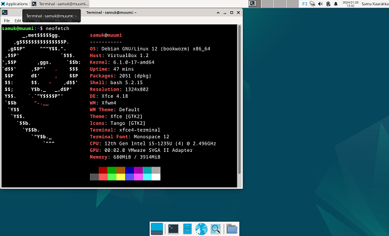

### d)FHS (Filesystem Hierarchy Standard)

##### Juurihakemisto (/):
* Sisältää kaikki muut tiedostot ja hakemistot

Kommennolla "ls /" tulostin juuritason hakemiston sisällön. Tämän jälkeen "cd /usr" kommennolla siirryin usr-hakemistoon. "ls"- komennolla tulostin usr-hakemiston sisällön, jonka jälkeen siirryin "cd /bin"-kommennolla bin kansion sisältöön. Eli lopputilanteessa olin hakemistossa /usr/bin, tämä hakemisto sisältää käytössä olevat ohjelmat sekä työkalut, lista oli todella pitkä: 

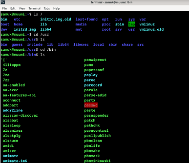

Valitsin tärkeäksi esimerkkikohdaksi listalta kohdan apt-get:

##### Kotihakemisto (/home/):
* Sisältää kaikkien käyttäjien kotihakemistot

Kommennolla "ls /home" tulostin kotihakemistot: 

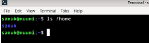

##### Käyttäjän kotihakemisto (/home/samuk/):
* Ainoa paikka missä kyseinen käyttäjä (tässä tapauksessa samuk voi tallentaa tietojaan pysyvästi)

Kommennolla "ls /home/samuk" tulostin oman käyttäjäni kotihakemistossa olevat tiedostot ja alihakemistot:

##### Järjestelmän laajuiset asetukset (/etc/): 
*Sisältää konfiguraatiotiedostot koko järjestelmänlaajuisille asetuksille
Kommennolla "ls /etc" tulostin tiedostot ja esimerkkitiedostoksi tulostin hostname kansion(näyttää koneeni nimen) kommennolla "cat /etc/hostname". 

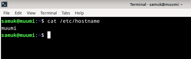

Tähän katsoin verkosta ohjeen miten tulostaa valitun tiedoston sisältö suoraan terminaalin käyttäen cat-komentoa.

##### Irrotettava media (/media/):
*Sisältää irrotettavan median esim. CD-levyt tai USB-tikut

Yritin "ls /media"-kommennolla tulostaa hakemiston sisällön, mutta se tulosti vain käyttäjänimeni. Oletan, että tämä johtuu siitä, että hakemisto on tyhjä, mitään irroitettavaa mediaa ei ole:

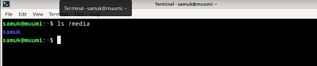

##### Järjestelmälokit (/var/log/):
*Sisältää järjestelmän lokitiedostoja

Kommenolla "sudo journalctl" tulostin järjestelmän lokitiedot (kuvassa näkyy vain osa, koska tiedostoja oli hyvin paljon):

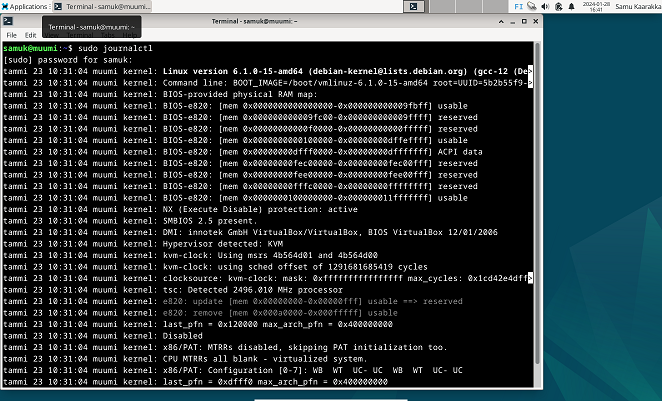

### e) The Friendly M

*Grep on työkalu, jonka avulla voi etsiä tekstimuotoisia merkkijonoja tiedostoista tai syötteestä.

Ensimmäisessä esimerkissä tein komennolla "cat > testi_tiedosto.txt" uuden tekstitiedoston nimeltä testi_tiedosto, jonne kirjotin sisään tekstiä. Tämän jälkeen kommennolla "grep "esimerkki" testi_tiedosto.txt" etsin ja tulostin tiedostosta rivit, jotka sisälsi sanan "esimerkki":

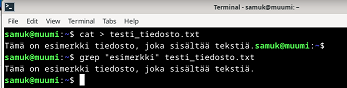

Toisessa esimerkissä etsin komennolla "grep "muumi" ~/ -r" kotihakemistostani. Kirjain -r viittaa rekursiiviseen hakuun eli haku ei rajoitu pelkästään nykyiseen hakemistoon vaan se kattaa myös alihakemistot. Komento tulosti sanan "muumi" sisältämät tiedostot: 

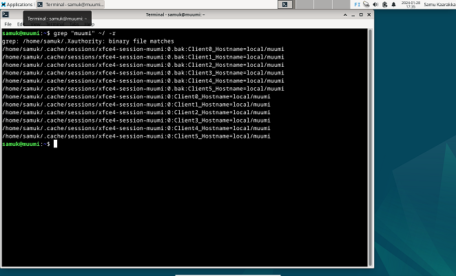

### f) Pipes
*Pystyviiva mahdollistaa kahden tai useamman komennon yhdistämisen. Käytin komentoa "ls | wc-l" tulostaakseni hakemistossa olevien tiedostojen määrän: 

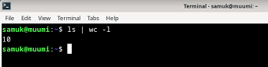

### g) Tukki

